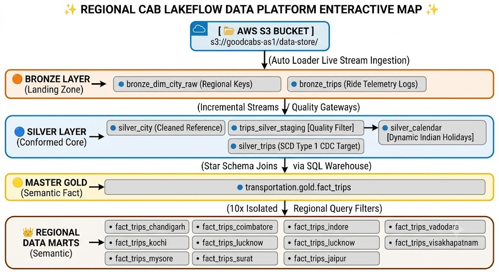
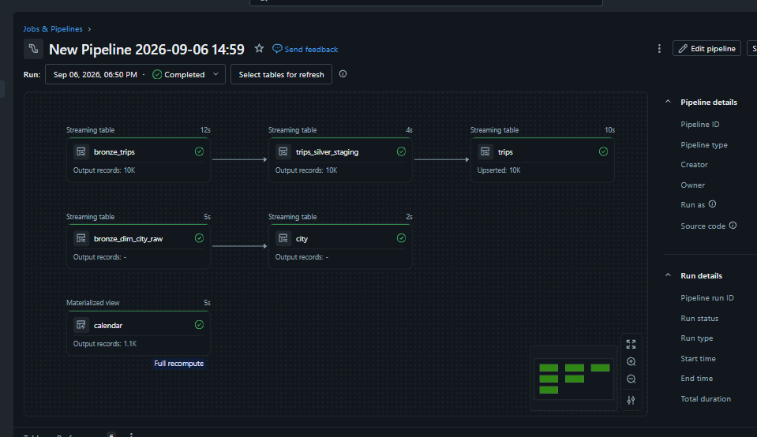
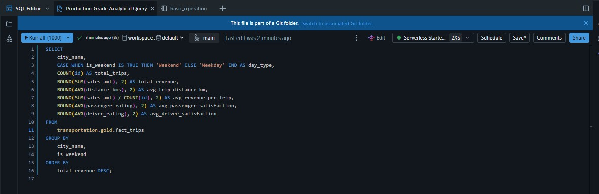
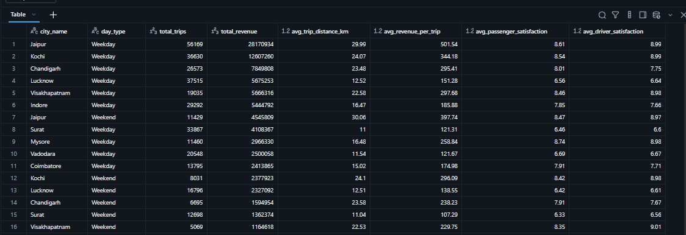

# Regional-Cab-Lakeflow
This project implements a regional cab service analytics platform using Databricks Lakeflow Spark Declarative Pipelines.It builds an efficient, incremental ETL architecture to deliver data-driven regional insights and optimize fleet operations.
# 🚖 Real-Time Regional Cab Insights Data Platform

An enterprise-grade, event-driven Medallion (Lakehouse) Data Platform built natively on Databricks Delta Live Tables (DLT) and orchestrated via Unity Catalog. The platform handles incremental ingestion, automated schema evolution, strict data quality enforcement, and Change Data Capture (CDC) to transform raw transit logs into optimized analytical assets for business intelligence reporting.

---
# Architecture & Data Workflow
The pipeline implements an enterprise-grade, cloud-native **Medallion Architecture** to process data seamlessly by decoupling storage (**AWS S3**) from compute (**Databricks Lakeflow**):


1. **☁️ AWS S3 Landing Zone (Storage Base):** 
   All multi-regional cab transaction records (raw CSV/Parquet streams) land directly in an **AWS S3 bucket**. This establishes a modern data lake architecture, securely storing raw files independently from downstream transformation compute clusters.
2. **🥉 Bronze Layer (Raw Ingestion):** 
   Databricks Delta Live Tables utilize Auto Loader (`cloud_files`) to read data incrementally and continuously from the **AWS S3 bucket path**. This stage preserves the raw historical audit trail without modifying structural fields.
3. **🥈 Silver Layer (Data Enrichment & Quality):** 
   Enforces strict schema evolution rules, checks data types, and applies quality parameters to remove anomalies. Trips are joined to municipality profiles and calendars.
4. **🥇 Gold Layer (Analytical Views):** 
   Aggregates granular records into a unified master fact view alongside isolated regional territorial tables indexed for low-latency BI queries.

---

## 🗂️ Data Pipeline Infrastructure (Layer-by-Layer)


### 1. Bronze Layer (`transportation.bronze_v2`)
The landing zone establishes an automated ingestion data pipeline using Databricks Auto Loader (`cloud_files`) to securely stream source files incrementally as they land in cloud storage.
*   **Source Storage Routing:** `s3://goodcabs-as1/data-store/`
*   **Operational Optimization:** Implements `maxFilesPerTrigger = 100` to prevent memory spikes and ensure efficient cluster batch utilization.
*   **Audit Logging Columns:** Appends `file_name` (`_metadata.file_path`) and `ingest_datetime` (`current_timestamp()`) to establish absolute data lineage.
*   **Resiliency:** Configured with `cloudFiles.schemaEvolutionMode = rescue` to automatically isolate unexpected column additions inside a hidden schema tracking parameter without crashing live pipelines.

### 2. Silver Layer (`transportation.silver`)
The corporate source of truth. This tier structures, cleanses, validates, and consolidates data across three key directories:
*   **`city`**: Standardized lookup table mapping regional city IDs to formal names.
*   **`calendar`**: A dynamic materialized date matrix. It handles time-series metrics by pre-calculating weekend indicators and mapping localized Indian National Holidays (Republic Day, Independence Day, Gandhi Jayanti) to track holiday travel trends.
*   **`trips_silver_staging`**: An internal pipeline streaming tier that enforces data quality constraints. Records are automatically dropped if they violate any of the following operational data metrics:
    -   `valid_date`: `business_date >= '2020-01-01'`
    -   `valid_driver_rating`: `driver_rating BETWEEN 1 AND 10`
    -   `valid_passenger_rating`: `passenger_rating BETWEEN 1 AND 10`
*   **`trips`**: The deduplicated destination table. It processes streaming rows from staging using an SCD Type 1 CDC Merge Flow (`APPLY CHANGES INTO`) to overwrite historical record corrections and insert new ride entries cleanly by primary key matching on `id`.


### 3. Gold Layer (`transportation.gold`)
The business intelligence semantic tier. To bypass schema namespace restrictions and eliminate dashboard loading lag, these views are deployed using a Databricks Serverless SQL Warehouse.
*   **`fact_trips`**: The centralized enterprise master fact dataset. It removes execution-time dashboard overhead by pre-joining `silver.trips`, `silver.city`, and `silver.calendar` to provide immediate access to travel volumes, sales amounts, and chronological granularities.
*   **Isolated Regional Access Slices**: Ten distinct semantic reporting views built directly on top of the master fact dataset. This allows analytical dashboards to hit targeted data caches instantly and lets administrators apply role-based access security for individual operating hubs:
    -   `fact_trips_chandigarh` (City ID: `CH01`)
    -   `fact_trips_coimbatore` (City ID: `TN01`)
    -   `fact_trips_indore` (City ID: `MP01`)
    -   `fact_trips_jaipur` (City ID: `RJ01`)
    -   `fact_trips_kochi` (City ID: `KL01`)
    -   `fact_trips_lucknow` (City ID: `UP01`)
    -   `fact_trips_mysore` (City ID: `KA01`)
    -   `fact_trips_surat` (City ID: `GJ01`)
    -   `fact_trips_vadodara` (City ID: `GJ02`)
    -   `fact_trips_visakhapatnam` (City ID: `AP01`)

---
## 📁 Catalog & Schema Directory Tree (Data Lineage)

When the data platform execution script is triggered, Databricks automatically generates a highly structured database hierarchy inside **Unity Catalog**. 

The folders (**Schemas**) and physical datasets (**Delta Tables & Views**) are instantiated dynamically according to this exact structural directory blueprint:

```text
📁 transportation (Master Project Catalog)
│
├── 📁 bronze_v2 (Raw Ingestion Folder)
│   ├── 📄 bronze_dim_city_raw    [Streaming Table - Raw City Landing Keys]
│   └── 📄 bronze_trips           [Streaming Table - Raw Ride Telemetry Logs]
│
├── 📁 silver (Cleaned Enterprise Core)
│   ├── 📄 trips_silver_staging   [Streaming Table - Quality Gateway & Guardrails]
│   ├── 📄 city                   [Materialized View - Standardized Lookup Directory]
│   ├── 📄 calendar               [Materialized View - Dynamic Indian Holiday Grid]
│   └── 📄 trips                  [Streaming Table - Deduplicated SCD Type 1 Master Core]
│
└── 📁 gold (Business Intelligence Semantic Layer)
    ├── 📊 fact_trips             [Master View - Pre-joined Star Schema Matrix]
    │
    └── 📂 Isolated Regional Slices [10x Specialized Hub Views]
        ├── 📄 fact_trips_chandigarh     (Hub: CH01)
        ├── 📄 fact_trips_coimbatore     (Hub: TN01)
        ├── 📄 fact_trips_indore         (Hub: MP01)
        ├── 📄 fact_trips_jaipur         (Hub: RJ01)
        ├── 📄 fact_trips_kochi          (Hub: KL01)
        ├── 📄 fact_trips_lucknow        (Hub: UP01)
        ├── 📄 fact_trips_mysore         (Hub: KA01)
        ├── 📄 fact_trips_surat          (Hub: GJ01)
        ├── 📄 fact_trips_vadodara       (Hub: GJ02)
        └── 📄 fact_trips_visakhapatnam  (Hub: AP01)
```

---

## ⚙️ Automated Directory Generation Logic

*   **Default Ingestion Routing:** The pipeline engine reads the core environment settings pointing to `bronze_v2`. Upon initialization, Databricks automatically sets up the physical cloud storage paths and metadata transaction folders for the landing files.
*   **Explicit Cross-Schema Separation:** By using explicit path names (`transportation.silver.*` and `transportation.gold.*`) directly inside the SQL compilation files, the engine overrides default system parameters. It automatically creates the physical `silver` and `gold` schema directories, ensuring the tiers stay perfectly isolated.
*   **Physical Cloud Footprint:** For every asset table generated above, Delta Lake builds a corresponding compressed sub-folder directory containing performance optimization metadata (`_delta_log/`) and columnar transaction files (`.parquet`).


## ⚡ Performance Optimization Configurations
To maintain near-instant response times for production analytics, all physical delta tables utilize advanced Delta Lake storage tuning properties:
*   `delta.enableChangeDataFeed = true`: Activates streaming change tracking for downstream applications.
*   `delta.autoOptimize.optimizeWrite = true`: Automatically balances layout file distributions while writing data to disk.
*   `delta.autoOptimize.autoCompact = true`: Continuously squashes small files in the background to prevent query performance decay.

---

## 🛠️ Execution & Deployment Details
*   **Pipeline ID:** `0e3cdf74-d17a-4185-af2c-6073d53a20f1`
*   **Runtime Execution Mode:** `Triggered Schedule` (Processes new data incrementally on-demand to minimize unnecessary cloud compute costs)
*   **Core Code Assets:**
    1.  `my_transformation.sql` — Auto Loader Bronze definitions.
    2.  `silver_transformation.sql` — Quality rules, standardization logic, and streaming SCD Type 1 tracking.
    3.  `calendar_transformation.sql` — Holiday matrix calculations.
*   **Active Pipeline Variables:**
    -   `start_date`: `2024-01-01`
    -   `end_date`: `2026-12-31`
## 📊 Business Insights & Analytics Showcase

This showcase demonstrates how corporate stakeholders and regional operations managers use the final **Gold Layer** assets to evaluate performance patterns across expanding Tier-2 territories.

### 💡 Stakeholder Scenario & Business Problem
> *"We need to examine our ride revenue matrix. Specifically, which cities generate the highest revenue per trip, how do passenger habits shift on weekends versus weekdays, and where can we identify gaps between driver performance and passenger satisfaction?"*

### 🛠️ Production-Grade Analytical Query
The query below evaluates the dataset using native boolean logic (`is_weekend IS TRUE`), preventing syntax parsing mismatches on strict-type schemas.

### 📈 Sample Analytics Output (Simulated Results)

### 🎯 Key Actionable Insights
1. **👑 Jaipur is the Core Growth Engine (High Ticket Sizes)**
   * **Insight:** Jaipur dominates both volume and total revenue (generating over ₹2.81 Crore on weekdays alone). Crucially, it maintains a massive **Average Revenue per Trip of ₹501.54** because riders take exceptionally long journeys (averaging ~30 km per trip).
   * **Action Plan:** Expand premium and outstation ride offerings specifically in Jaipur to capitalize on long-distance commuter behavior. Since passenger and driver ratings are stellar (~8.9/10), consider duplicating Jaipur's operational blueprint in other markets.

2. **⚠️ The Lucknow & Surat Service Quality Deficit**
   * **Insight:** Both Lucknow and Surat generate massive trip volumes (37.5k and 33.8k trips respectively), proving strong organic demand. However, their passenger and driver ratings are remarkably low (**6.4 - 6.6 out of 10**), indicating high user dissatisfaction.
   * **Action Plan:** Launch an immediate ground-ops audit in Lucknow and Surat. The low ratings likely point to massive traffic bottlenecks, localized network dead-zones, or a supply shortage leading to high cancellations. Implement localized driver training and targeted completion bonuses to turn these markets around.

3. **📊 Weekday Commute Dominance vs. Weekend Drop-off**
   * **Insight:** Across the highest-performing markets (Jaipur, Kochi, Chandigarh), weekday revenue completely eclipses weekend revenue. For instance, Jaipur's trip volume drops from 56k on weekdays to just 11k on weekends.
   * **Action Plan:** Re-allocate the marketing budget away from weekend promotions and heavily target corporate/weekday commuter tie-ups. Implement a dynamic pricing multiplier on weekdays to optimize margins when demand peaks.

---
## 🚀 Setting Up the Repository in Databricks

Follow these steps to initialize or clone this pipeline into a new Databricks Git Folder workspace:

1. **Configure Git Integration:**
   * Go to **User Settings > Linked accounts** inside your Databricks Workspace.
   * Add your Git provider credentials utilizing a **Personal Access Token (Classic)** with full `repo` permissions enabled.
2. **Clone Workspace Folder:**
   * Right-click the **Repos/Git Folders** catalog path -> **Create > Git Folder**.
   * Provide the HTTPS Git repository string hook to sync automatically.
3. **Run DLT Pipeline:**
   * Create a new **Delta Live Tables** pipeline configuration job pointing to the script source path.

---

## 🔄 Reconnecting Your Workspace to GitHub (Troubleshooting)

If you close your Databricks session and return to find that the `regional-cab-lakeflow` folder inside **Repos** appears empty, your workspace link needs to be refreshed. Follow these exact steps to safely reconnect and recover your files:

### Step 1: Generate a New Token on GitHub
1. Go to your GitHub profile, click your profile picture, and navigate to **Settings > Developer Settings > Personal access tokens (classic)**.
2. Click **Generate new token > Generate new token (classic)**.
3. Provide a clear note name (e.g., `databricks-session-recovery`).
4. Select the **`repo`** scope checkbox to give Databricks access to your code files.
5. Click **Generate token** and **copy the secret token immediately** (it will hide itself once you leave the page).

### Step 2: Clear Out the Frozen Folder & Fresh Clone
1. In Databricks, right-click the empty `regional-cab-lakeflow` folder in your left file tree and select **Trash / Delete**.
2. Go to your GitHub project repository page on the web, click the green **<> Code** button, and copy the **HTTPS URL**.
3. Return to Databricks, right-click the parent **Repos** folder in the sidebar, and choose **Create > Git folder**.
4. Paste your GitHub repository HTTPS URL into the input field.
5. Provide your credentials when prompted:
   * **Git Provider Username:** Your GitHub account username/email.
   * **Token / Password:** Paste the fresh **Personal Access Token** you generated in Step 1.
6. Click **Create** or **Clone**. The Lakeflow pipeline files and notebooks will immediately download back into your workspace layout.

